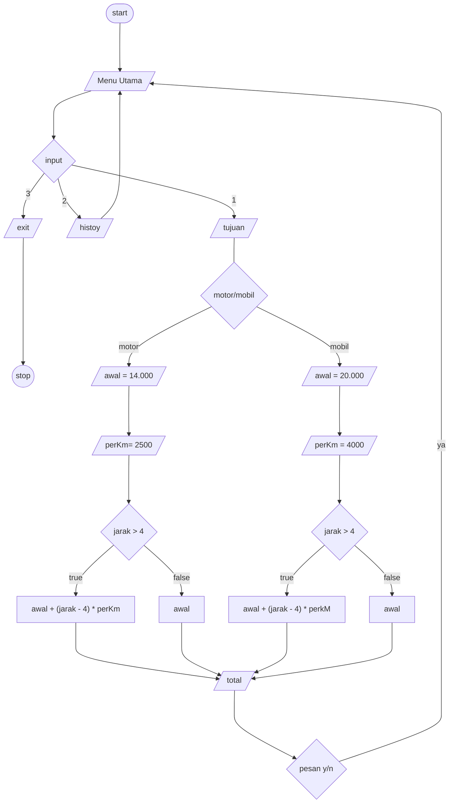

# Aplikasi ojek online
### Aplikasi pelayanan tranfortasi online karya anak bangsa
## Fitur Utama
* Menyediakan layanan tranportasi online mobil dan sepeda motor
* Mengkalkulasi tarif berdasarkan jarak per/kilometer
* Menyimpan history perjalanan

