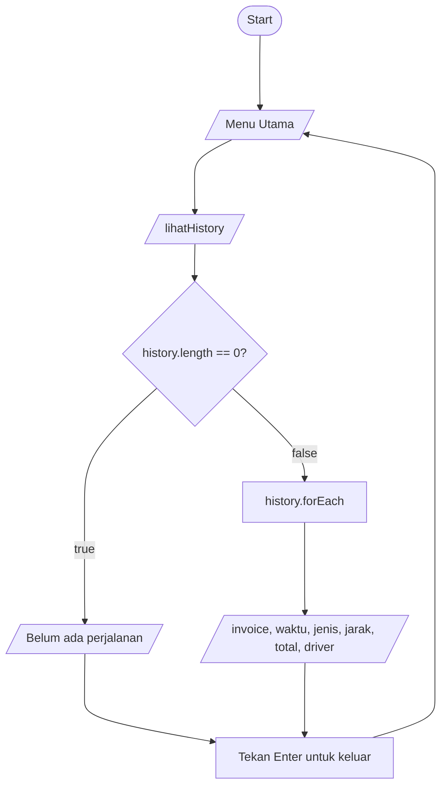

## floechart history

```mermaid
flowchart TB
A([Start])
a[/Menu Utama/]
c[/lihatHistory/]
e{history.length == 0?}
f[/"Belum ada perjalanan"/]
g[history.forEach]
h[/invoice, waktu, jenis, jarak, total, driver/]
i[Tekan Enter untuk keluar]

A--->a
a--->c-->e

e--true-->f--->i
e--false-->g--->h--->i--->a

```