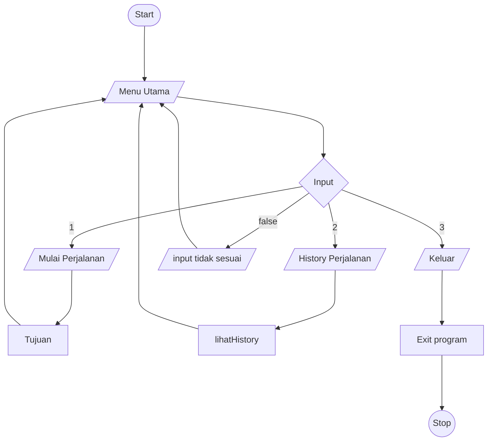

# Flowchart Menu Utama 

```mermaid
flowchart TB
A([Start])
Z((Stop))
a[/Menu Utama/]
desi1{Input}
b[/Mulai Perjalanan/]
c[/History Perjalanan/]
d[/Keluar/]
e[Tujuan]
f[lihatHistory]
g[Exit program]
h[/input tidak sesuai/]
A--->a--->desi1
desi1--1-->b--->e--->a
desi1--2-->c--->f--->a
desi1--3-->d--->g--->Z
desi1--false-->h--->a
```