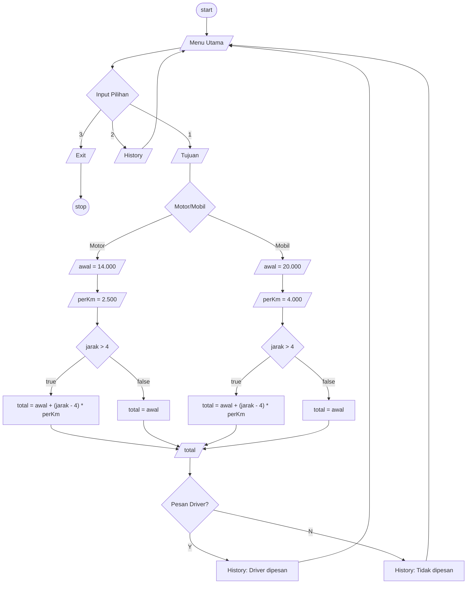

## flowchar pilih tujuan mulai perjalanan

```mermaid
flowchart TB
A([start])
Z((stop))
a[/Menu Utama/]
desi1{Input Pilihan}
b[/Tujuan/]
c[/History/]
d[/Exit/]
desi2{Motor/Mobil}
e[/awal = 14.000/]
f[/perKm = 2.500/]
desi3{jarak > 4}
g@{shape: proc, label: "total = awal + (jarak - 4) * perKm"}
h[total = awal]
i[/total/]
j[/awal = 20.000/]
k[/perKm = 4.000/]
desi5{jarak > 4}
l@{shape: proc, label: "total = awal + (jarak - 4) * perKm"}
m[total = awal]
desi6{Pesan Driver?}
n@{shape: proc, label: "History: Driver dipesan"}
o@{shape: proc, label: "History: Tidak dipesan"}

A --> a --> desi1
desi1 -- 1 --> b --- desi2
desi1 -- 2 --> c --> a
desi1 -- 3 --> d --> Z

desi2 -- Motor --> e --> f --> desi3
desi3 -- true --> g --> i
desi3 -- false --> h --> i
i --> desi6

desi2 -- Mobil --> j --> k --> desi5
desi5 -- true --> l --> i
desi5 -- false --> m --> i

desi6 -- Y --> n --> a
desi6 -- N --> o --> a
```